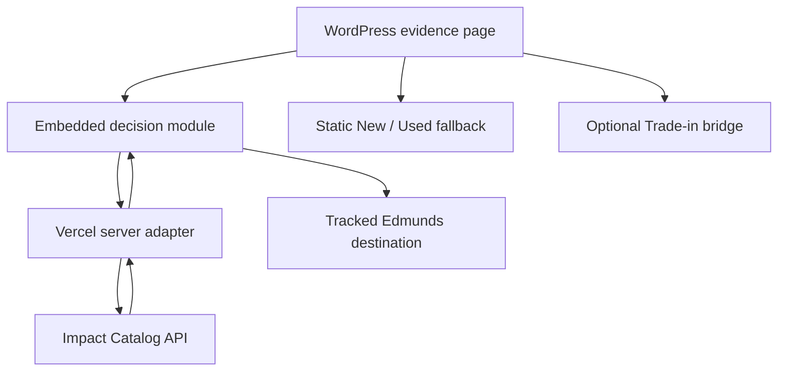
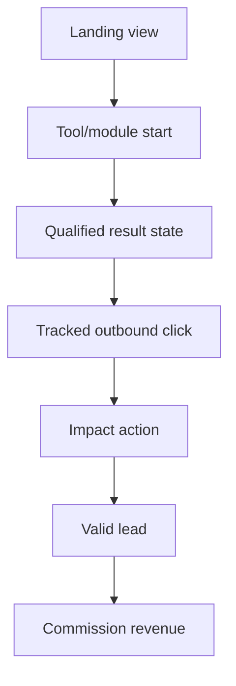

# Completion addendum — successful C1–C8 evidence (2026-09-21)

This addendum supersedes the authentication and unverified-capability statements in the original return below.

André completed the bounded C1–C8 run from a separate local Python client. The final evidence is in `RETURN_IMPACT_CATALOG_C1_C8_READ_ONLY_TESTS_20260920.md`.

The Catalog layer is now **feasible with material constraints**:

- exact model filtering through `Text1` works;
- category plus maximum-price filtering works;
- the feed-specific dealer mapping through `Manufacturer` works;
- thin and empty results are structurally safe;
- the traversal window is 20,000 items;
- the observed item-endpoint allowance is 3,000 requests/hour;
- returned URLs are structurally valid Impact/Edmunds tracking URLs;
- there is still no proven ZIP/radius capability;
- most importantly, `Condition` is missing from sampled items and rejected as an unknown search field.

Therefore Sections 8–14 below must be interpreted with these corrections:

1. remove the New/Used/Either selector from the first Catalog prototype;
2. never display or infer New/Used/CPO from Catalog or vehicle model year;
3. keep separate approved static New and Used CTAs aligned to the host page’s editorial intent;
4. describe cards neutrally as a complementary set of current Edmunds listings;
5. retain the no-ZIP/radius boundary;
6. treat NHTSA as optional VIN specification validation only—not ownership, title or sale-condition evidence;
7. proceed only to the private/noindex prototype specified in `HANDOFF_CLAUDE_IMPACT_CATALOG_PRIVATE_PROTOTYPE_20260921.md`; public launch remains separately gated.

The earlier blocked browser-session attempt is retained in the historical record, but it is no longer the controlling feasibility conclusion.

---

# Return: Tool-Led Impact Funnel Feasibility

**Task:** #69  
**Date:** 2026-09-20  
**Owner:** ChatGPT  
**Phase:** Read-only research and architecture  
**Governing handoff:** `HANDOFF_CLAUDE_TOOL_LED_IMPACT_FUNNEL_FEASIBILITY_20260920.md`  
**Governing strategy:** `STRATEGY_TOOL_LED_SEO_GEO_MONETIZATION_SYSTEM_20260920.md`

## Correction — agreement review and André confirmation (2026-09-20)

This section supersedes the original rights-gate language elsewhere in the first version of this return.

- André confirmed that the contracting GetCarWise business is based in the United States; his personal location in Australia does not change the business's primary place of business.
- The current Edmunds/Impact agreement routes users through unchanged Required Tracking Links to Edmunds-hosted listing and lead-submission experiences. GetCarWise does not collect or submit the lead.
- The intended module performs a read of advertiser-supplied Product Catalog records and displays selected records using returned fields and URLs. It does not modify Edmunds creative or the returned tracking link.
- Prior Impact support guidance recommended downloading the approximately 1.2–1.334 million-record catalog. That account-specific guidance is consistent with Catalog consumption being an intended partner use; GetCarWise proposes a much narrower query/read pattern.
- Filtering or selecting returned records is not treated here as modification of an Approved Ad. Any GetCarWise analysis or scoring must remain visually and semantically separate from the catalog-supplied listing content.
- No new permission enquiry is required before the read-only C1–C8 account tests. The remaining gates are fresh authenticated behavior evidence, geography limitations, attribution/consent, and controlled pilot design.

## 1. Executive recommendation

GetCarWise can build a reusable tool-led monetization system, but the correct status is **conditionally feasible** rather than build-ready.

The recommended system is:

1. evidence-led WordPress pages remain the indexable acquisition and explanation layer;
2. a reusable Vercel-hosted inventory-continuation module handles interaction and server-side calls;
3. Impact Catalog supplies a complementary Edmunds inventory subset and partner-specific tracked item URLs;
4. static Impact New, Used, and optional Trade-in destinations remain the always-available fallback;
5. a small first-party event contract connects landing context, tool use, outbound clicks, Impact action reporting, and commission reporting without collecting VINs, emails, or other unnecessary personal data.

This architecture is technically credible because the Partner Catalog API exposes per-catalog item queries and returns price, condition, stock state, images, and a partner-specific tracked product URL. Prior verified account work also found an Edmunds catalog of roughly 1.334 million records, with dealer/model/body-style mappings usable for discovery. Agreement review plus André's account-specific facts remove the previously proposed separate permission enquiry. Two material evidence gaps remain:

- **Fresh account-level verification:** authenticated Impact access was blocked in this session by a Cloudflare human-verification loop, so condition filtering, current counts, latency, current limits, and thin-market behavior could not be re-run.
- **Geographic precision:** the documented Partner Catalog model has no supported ZIP, latitude/longitude, radius, or distance filter. A local-inventory promise is therefore not supportable from Catalog alone.

The safest next step is **not a production page**. Restore authenticated access and run C1–C8 read-only, then use the results to finalize a noindex/password-protected prototype specification. An eventual production pilot should be a single page, isolated from the current $30k, PHEV, $25k, midsize-sedan, and Tools-hub work. The first candidate should be chosen only after baseline conflicts are checked.

Publisher Tag should not be installed for the first prototype. It does not replace already-affiliated links, is not required for Catalog-returned tracked URLs, introduces consent/governance work, and only unlocks page-level reporting when paired with Trackonomics Essentials. Revisit it after the basic module and attribution contract prove value.

## 2. Current technical surface inventory

| Surface | Current state | Feasibility implication |
|---|---|---|
| WordPress editorial pages | Gutenberg/Rank Math pages with long-form evidence-led copy, disclosures, contextual CTAs, and some embedded tools | Keep WordPress as the canonical, indexable content layer. Do not replace strong editorial pages with thin application shells. |
| `/tools/` | Indexable router/hub with existing search visibility | Preserve as a router. Do not make it the first monetization host or alter it during this work. |
| `/tools/price-check/`, `/tools/deal-score/`, `/tools/vin-check/` | Predominantly iframe/widget shells with sparse WordPress content | Demonstrates that Vercel embeds work, but also demonstrates the thin-page risk. A new module should sit inside useful editorial content or a deliberately noindex prototype. |
| CarClever Lite | Next.js/Vercel client experience using `/api/chat`, query-string prompts, and client-side ZIP memory | Suitable host/codebase pattern for a reusable interactive module, provided a server-side adapter keeps Impact credentials out of browsers. |
| Existing analytics | GA4 is loaded by the Vercel app; VIN-specific helper events exist | A module contract must coordinate consent across WordPress and iframe/app surfaces, avoid duplicate page/session events, and send no VIN or personal identifiers. |
| WordPress affiliate links | Current live New/Used/Trade-in paths are largely legacy CJ; active treatment pages intentionally preserve their existing links | Do not overwrite or migrate links in this phase. Catalog and Impact work must be isolated from those experiments. |
| Static Impact links | The app/MCP documentation records a working `edmunds.sjv.io` wrapper and known exact destinations | Useful as fallback and as controlled CTA destinations. Generate/manage links in Impact rather than editing tracking parameters ad hoc. |
| Impact Product Catalog | No WordPress runtime integration and no public inventory module today | New server-side integration is required; direct browser-to-Impact calls are inappropriate. |
| Publisher Tag | Available in Impact, not installed | Optional later measurement layer, not a prerequisite for the first module. |
| Consent surface | Public pages expose Functional, Preferences, Statistics, and Marketing categories through Complianz | Any new GA4/Impact impression or identity behavior needs explicit category mapping and cross-frame consent handling before production. |

Repository inspection found no current runtime that queries the Impact Catalog, no ZIP/radius inventory engine, and no end-to-end contract joining module behavior to valid Impact actions and commission revenue.

## 3. Impact mechanism matrix

| Mechanism | What it can do | What it cannot safely be assumed to do | Recommendation |
|---|---|---|---|
| Static tracking link | Send a user to an approved Edmunds destination with Impact attribution. A permitted `u` parameter can deep-link to a destination path. | It does not expose inventory data or prove that an arbitrary destination is allowed. Hand-editing can damage required parameters. | Use Impact-generated/managed New, Used, and Trade-in links as fallbacks. Preserve all existing CJ links until a separately authorized migration. |
| Catalog item `Url` | Official schema describes it as a tracking URL unique to the partner account. Prior account evidence found working pre-tracked listing links. | It does not establish inventory completeness, geographic accuracy, or a stable vehicle schema. | Preferred outbound URL for a displayed Catalog result after live tests pass. Use it unchanged; never reconstruct, wrap, mask, or proxy it. |
| Product Catalog query | Per-catalog `/Items` accepts a `Query`; cross-catalog `ItemSearch` accepts a keyword. Returns structured item fields. | Generic public docs do not guarantee Edmunds-specific semantics for `Text1`, `Manufacturer`, or every returned field as queryable. No documented ZIP/radius query. | Use a server-side adapter with a feed-field mapping registry, allowlist, validation, caching only if permitted, and static-link fallback. |
| Publisher Tag link transformation | Converts eligible direct joined-brand links to tracking links while preserving the landing page. | It respects existing affiliate links and does not replace their tracking; therefore it will not migrate existing CJ links. | Not needed for first prototype. Consider later for approved direct Edmunds links. |
| Publisher Tag impression tracking | Sends one impression per unique URL on page load; basic integration supports impression tracking. | It adds client-side marketing measurement and consent work. | Evaluate only after legal/consent review and a proven production use case. |
| Publisher Tag page-level attribution | Associates link performance with a page/story context. | Impact documentation says page-level reporting requires Trackonomics Essentials. | Do not make the initial architecture depend on it. First-party page/module IDs plus SubIds can cover the initial pilot. |
| Publisher Tag `identifyUser` | Advanced user recognition using a hashed identifier and device/session signals. | It is unnecessary for the proposed MVP and raises privacy, consent, and implementation scope. | Exclude from prototype and pilot. |

Official references:

- Impact Partner Catalog endpoints and schema: <https://integrations.impact.com/partner-api-reference/partner-v15/reference/catalogs/catalogs>
- Publisher Tag FAQ: <https://help.impact.com/brand/what-would-you-like-to-learn-about/platform-features/tracking/tracking-explained/publisher-tag-faq>
- Publisher Tag implementation for partners: <https://help.impact.com/partner/what-would-you-like-to-learn-about/platform-features/tracking/tracking-links/create-and-manage-links/publisher-tag-implementation-for-partners.md>
- Tracking-link reporting parameters: <https://help.impact.com/partner/what-would-you-like-to-learn-about/platform-features/tracking/tracking-links/create-and-manage-links/add-reporting-information-to-your-tracking-links.md>

## 4. Exact Catalog test ledger

### 4.1 Execution status

No authenticated Catalog request was executed on 2026-09-20. Impact account access stopped at a repeating Cloudflare “Just a moment…” human-verification challenge. The ledger therefore separates:

- **officially documented request capability**;
- **prior verified GetCarWise account evidence**; and
- **tests still required before implementation**.

No counts, latency values, or fresh result examples are invented below.

### 4.2 Endpoint and query shapes

Credentials, AccountSID, and CatalogId are intentionally omitted. Exact reusable request templates are:

```text
GET https://api.impact.com/Mediapartners/{AccountSID}/Catalogs
GET https://api.impact.com/Mediapartners/{AccountSID}/Catalogs/{CatalogId}
GET https://api.impact.com/Mediapartners/{AccountSID}/Catalogs/{CatalogId}/Items?Query={encoded_expression}
GET https://api.impact.com/Mediapartners/{AccountSID}/Catalogs/ItemSearch?Keyword={encoded_keyword}&PageSize={n}&Page={n}
```

Official v15 documentation describes `Query` as a comparison expression and gives examples such as `CurrentPrice > 50` and `Manufacturer == 'Wayne Enterprises'`. The cross-catalog endpoint is keyword-based rather than a substitute for structured per-catalog filtering.

### 4.3 Representative pre-build tests

| ID | Intent | Exact logical test | Expected evaluation | Current evidence/status |
|---|---|---|---|---|
| C1 | Mainstream model | Per-catalog Items with an account-verified model expression for `CR-V`; request 10–20 records; record total/returned count, first-byte/complete latency, condition mix, duplicates, required field completeness, and URL resolution | Confirms model mapping and healthy-result behavior | Prior account work found model search through `Text1`. Generic public docs expose `Text1` in the response model but do not explicitly guarantee it as queryable. **Must re-test.** |
| C2 | PHEV/New-vs-Used | Model expression for `Outlander PHEV`, then separate `Condition == 'New'` and `Condition == 'Used'` requests if accepted; otherwise fetch a bounded result set and split by returned `Condition` | Confirms whether condition is server-filterable and whether both inventory types are viable | `Condition` is an official returned field. Server-side filter support for this Edmunds catalog is **unverified**. |
| C3 | Body style and budget | `Category` mapped to SUV combined with `CurrentPrice <= 30000`; repeat at `$25,000` | Confirms combined filters, price parsing, body-style semantics, and result density | Prior account work found body style in `Category`; official docs support price query examples. Combined Edmunds behavior is **unverified today**. |
| C4 | Dealer filter | Use the prior observed dealer-name mapping in `Manufacturer`; verify exact vs contains behavior and returned dealer/address fields | Confirms whether a dealer-specific continuation can be supported | Prior account work found dealer search through the misleading `Manufacturer` field. Treat as feed-specific and unstable until re-tested. |
| C5 | Thin-result market | `RAV4 Prime` with `CurrentPrice <= 25000`, then a rarer body/fuel/budget combination selected from the tool matrix | Confirms zero/low-result UX and fallback thresholds | No fresh count or latency available. Prototype must assume zero results are normal. |
| C6 | Pagination ceiling | Run a deliberately broad query and page to the documented/account-observed boundary | Confirms actual response metadata and the 20,000-result traversal ceiling | Project evidence records a 20,000 pagination cap. Must re-confirm in the current account. |
| C7 | Rate and resilience | Controlled serial requests, then a small bounded burst; record headers, 429 behavior, retry guidance, and recovery | Establishes safe application throttles | Project evidence records 3,600 requests/hour. Official page was not accessible in this session; do not treat this as a permanent contractual limit. |
| C8 | Tracking URL integrity | Open a returned `Url` in a read-only test, capture redirect chain/domain, and verify the landing item and Impact click reporting | Confirms end-to-end tracked destination | Prior account evidence says returned URLs worked. Fresh validation is required before a pilot. |

### 4.4 Fields to capture for every test

For each request, store only a sanitized test record:

- test ID and timestamp;
- query expression without credentials/account identifiers;
- HTTP status and documented rate-limit headers;
- total/returned count and pagination metadata;
- time to first byte and complete response time;
- percentage with `Url`, `ImageUrl`, `CurrentPrice`, `Condition`, `StockAvailability`, dealer name/address, year/model/trim;
- duplicate rate by stable item ID and, only internally if present, VIN-derived identity without writing VIN to analytics;
- number of dead/mismatched tracked URLs;
- cache-control or freshness indicators;
- zero-result and thin-result fallback taken.

### 4.5 Latency, rate limits, and thin results

Current latency is unknown because fresh authenticated calls were blocked. The architecture must therefore use explicit budgets rather than assume API speed:

- module shell should render independently of Catalog;
- server response target: p50 under 800 ms and p95 under 2,000 ms after any permitted cache;
- fail closed to the static New/Used CTA after a short timeout rather than delay page content;
- request only enough records to render 3–6 cards;
- cap retries; use exponential backoff only for retryable server/429 responses;
- treat 0–2 usable results as thin and switch to a transparent fallback state;
- never broaden a user’s budget, condition, or model silently just to fill cards.

The prior 3,600 requests/hour and 20,000-result traversal cap are planning constraints, not verified service-level guarantees.

## 5. Geography findings

### 5.1 What the evidence supports

- The generic Catalog object includes `ServiceAreas` and an advertiser location.
- Prior account evidence found dealer information/address in Edmunds item data.
- A ZIP can be collected by the GetCarWise interface as a user preference and can be carried to an approved Edmunds destination where permitted.

### 5.2 What the evidence does not support

The documented Partner Catalog item schema does not expose a standard latitude, longitude, ZIP-radius, or distance field/filter. `ServiceAreas` is catalog-level metadata, not proof of vehicle-level proximity. A returned dealer address can support transparent location labeling or bounded post-selection, but it does not create a trustworthy radius search by itself.

Therefore the first module must not claim:

- “vehicles within X miles”;
- “nearest inventory”;
- comprehensive inventory for the entered ZIP;
- deterministic dealer proximity; or
- a complete replacement for Auto.dev or Edmunds search.

### 5.3 Safe ZIP behavior

For the first module, ZIP should be optional and described as “used to continue your search on Edmunds,” not “filter this inventory near you,” unless a live test proves an approved downstream deep link accepts it. Do not send ZIP to GA4. If GetCarWise later adds geocoding, that is a separate data source, cost, caching, accuracy, and privacy decision; it still would not solve missing inventory coverage.

## 6. Agreement interpretation and operating guardrails

Agreement review and André's account-specific confirmation support proceeding with Catalog-read feasibility without a new permission request:

- the contracting GetCarWise business is US-based;
- users follow the returned, unaltered Required Tracking Link to an Edmunds-hosted listing and lead-submission experience;
- GetCarWise reads advertiser-supplied Catalog records rather than modifying an Edmunds creative;
- prior Impact support guidance recommended downloading the full catalog, confirming Catalog consumption as an intended partner workflow;
- GetCarWise proposes narrow queries and 3–6 returned records, not mass republishing.

The initial module should nevertheless use conservative operating guardrails:

| Area | Guardrail |
|---|---|
| Display | Show only Catalog-supplied listing fields needed for the decision/continuation module. |
| Tracking | Use the returned Impact URL unchanged; never reconstruct, wrap, proxy, mask, or obscure it. |
| Creative | Do not rewrite Edmunds creative. Keep independent GetCarWise analysis visibly separate from Catalog content. |
| Selection | Filtering, bounded selection, deduplication, and neutral ordering may be used to surface relevant returned records. Any proprietary score must have its own documented methodology and must not imply Edmunds endorsement. |
| Freshness | Refresh inventory appropriately; label price/availability as changeable; remove or suppress dead/stale results. |
| Coverage | Describe the feed as complementary Edmunds inventory, never complete US inventory. |
| Geography | Do not claim ZIP/radius or “nearest” behavior until C1–C8 or later approved evidence proves it. |
| Storage | Avoid a bulk persistent mirror for the first pilot. Retain only sanitized evidence needed for testing and debugging. |
| Indexing | Keep prototype output noindex. Decide production rendering/indexing in the later SEO/pilot review, avoiding thin feed-derived pages. |
| Attribution | Maintain affiliate disclosure and `rel="sponsored"`; measure first-party context without changing the returned URL. |

A new Edmunds/Impact support enquiry is unnecessary unless later implementation departs materially from this catalog-read pattern or encounters a concrete agreement/API contradiction.

## 7. Architecture comparison

| Option | Benefits | Risks/limits | Verdict |
|---|---|---|---|
| WordPress-only, server-side plugin | Same-origin rendering; potentially strong SEO integration | Introduces credentials and custom query/caching code into production WordPress; harder rollback; greater operational and plugin risk; conflicts with a research-only phase | Reject for first prototype |
| WordPress-only, browser-side API | Simple embedding | Exposes credentials, creates CORS/security problems, leaks request mechanics, and cannot safely enforce rate limits | Reject |
| Static links/cards authored in WordPress | Lowest operational risk; easy disclosure and rollback | No live inventory, personalization, or reusable query layer | Keep as fallback/control |
| Vercel module embedded in WordPress | Reuses current app hosting pattern; isolates credentials server-side; independently deployable/rollbackable; reusable across pages | Cross-frame consent/session attribution; possible thin-page/CLS/accessibility issues; no SEO value if core content exists only in iframe | **Recommended interaction layer** |
| WordPress content plus Vercel API and native WP rendering | Better native page semantics and accessibility | Requires new WordPress frontend code and API integration; more production coupling | Possible phase 2 after proof |
| Full Vercel tool page | Fast product iteration and clean API boundary | Risks splitting canonical SEO/content ownership and duplicating WordPress page concerns | Use only for noindex internal prototype, not first indexable production page |

## 8. Recommended architecture

Use a **WordPress editorial shell + Vercel module + server-side Impact adapter**.



Responsibilities:

| Layer | Responsibility |
|---|---|
| WordPress | Indexable evidence, methodology, disclosure, contextual explanation, module placement, static fallback CTA, canonical metadata |
| Embedded module | Collect only decision inputs; show loading/result/empty/error states; emit first-party events; never hold Impact credentials |
| Vercel adapter | Validate an allowlisted query schema; map feed fields; call Impact; enforce timeout/throttle; redact logs; apply permitted cache; return a minimal normalized response |
| Impact | Supply catalog results, partner-specific tracked URLs, clicks/actions/commission reporting |
| Measurement layer | Join page, module, query class, outbound click, Impact action status, and revenue at an aggregate/non-PII level |

Security and operational rules:

- credentials remain server-only and in the existing secure environment-variable mechanism;
- the browser receives only fields approved for display;
- no full VIN, email, phone, street address, or ZIP in analytics;
- no arbitrary user-supplied Impact Query expression;
- allowlist condition, model token, body style, price band, and controlled sort options;
- sanitize all returned text and validate outbound URLs against approved Impact/Edmunds hosts;
- module failure must never break the editorial page;
- accessibility, responsive height, keyboard behavior, and no-layout-shift behavior are acceptance criteria;
- prototype inventory output remains non-indexable; production indexing requires a separate SEO quality review and must not create thin feed-derived pages.

## 9. First inventory-continuation module specification

### 9.1 Purpose

Help a reader move from “I understand the decision” to “show me plausible Edmunds inventory,” without pretending GetCarWise is a comprehensive marketplace.

### 9.2 Inputs

- context supplied by the host page: topic/model/body style and default budget;
- user-selectable condition: New, Used, or Either;
- maximum price from a bounded list/range;
- optional ZIP, used only for an approved downstream continuation—not claimed as a Catalog radius filter;
- no free-form VIN, name, email, or phone.

### 9.3 Output

Render at most 3–6 result cards. Each usable card should include only Catalog-supplied fields needed for the module:

- year/make/model/trim or feed name;
- condition;
- current price and currency;
- stock state or “availability may change” wording;
- dealer name/location when returned;
- image when returned and available;
- clearly labeled “View on Edmunds” action using the returned `Url` unchanged except for platform-approved reporting parameters.

Default ordering should be neutral and explicitly labeled for the first pilot. Any later GetCarWise score must use a documented methodology, remain separate from Edmunds-supplied content, and avoid implying Edmunds endorsement.

### 9.4 Required states

| State | User experience |
|---|---|
| Initial | Short explanation, condition/budget controls, and an always-visible New/Used fallback |
| Loading | Skeleton/compact progress; editorial content remains usable |
| Healthy | 3–6 cards plus “inventory changes quickly” disclosure |
| Thin (1–2) | Show available matches, state that the feed is incomplete, and offer broader Edmunds search without silently changing constraints |
| Empty | “No matches in this feed” plus New/Used Edmunds continuation; do not say no vehicles exist |
| Error/timeout | No technical details; show static approved destination and permit retry once |
| Missing fields | Suppress the absent field/card rather than infer or fabricate it |

### 9.5 Guardrails and acceptance criteria

- 100% of result clicks use an approved returned tracking URL or an approved static fallback.
- The module never claims local completeness or a radius.
- No result is displayed after its allowed freshness window.
- No credentials or raw upstream response appear client-side or in logs.
- Every state works at mobile width, with keyboard and screen reader support.
- Editorial page performance and Core Web Vitals remain within the pre-pilot budget.
- Module events are deduplicated and contain no prohibited personal data.
- A kill switch can replace the module with static links without editing page content.

## 10. Optional Trade-in bridge

Trade-in is a useful but secondary bridge. It should appear only after the user expresses ownership or replacement intent, such as selecting Used, choosing “replace my current car,” or finishing a cost-of-ownership tool.

Recommended pattern:

- label: “Have a car to sell or trade?”;
- one-sentence value explanation;
- button to the approved static Impact Trade-in destination;
- separate affiliate disclosure and separate event;
- no invented combined transaction, guaranteed valuation, or implication that Edmunds inventory and trade-in are one GetCarWise application.

The project evidence records a lower Trade-in payout than New/Used, so Trade-in should not displace the primary inventory continuation. It can increase total funnel coverage without changing the decision tool’s main job.

## 11. Measurement and event contract

### 11.1 Funnel model



“Valid lead” means an Impact action that reaches the program’s approved/valid state after reversals or rejection rules—not merely a GetCarWise click. Revenue means finalized/recognized commission from Impact reporting. The pilot should report both click-to-action and action-to-valid rates.

### 11.2 Identifiers

Use opaque, non-personal identifiers:

| Identifier | Purpose | Rules |
|---|---|---|
| `page_id` | Stable page/intent identifier | Slug-like internal code; no full URL query string |
| `module_id` | Module family/version | Example logical value: `inventory_continuation_v1` |
| `placement_id` | Distinguish inline/end-of-page/sidebar | Stable controlled vocabulary |
| `session_id` | First-party anonymous session stitching | Random, short-lived, consent-aware; not shared if policy forbids |
| `search_id` | One module submission | Random UUID; never encode user inputs |
| `result_id` | Normalized opaque result reference | Hash/internal ID; do not send VIN |
| `click_id` | One outbound click | Stored first-party and mapped to Impact-safe parameters where permitted |
| `experiment_id` / `variant_id` | Treatment isolation | Omit outside an approved experiment |

For Impact parameters, use the platform’s link builder or API-supported method. Impact documents `SubId1`, `SubId2`, and `SubId3` for partner reporting and `SharedId` for both partner and brand reporting. `SharedId` is restricted to letters/numbers and under 255 characters. A conservative mapping is:

- SubId1 = `page_id`
- SubId2 = `module_id` + placement code
- SubId3 = coarse query/variant code
- SharedId = optional opaque click correlation token only after Edmunds agrees to its use

Do not remove existing metadata or append arbitrary parameters to pre-tracked URLs.

### 11.3 Event schema

Common fields on every event: `event_version`, timestamp, `page_id`, `module_id`, `placement_id`, consent state, device class, referrer class, experiment/variant if applicable.

| Event | Trigger | Additional allowed fields |
|---|---|---|
| `inventory_module_view` | Module becomes viewable | render mode, default condition/budget class |
| `inventory_module_start` | First interaction | control name only |
| `inventory_search_submit` | Valid search submitted | `search_id`, condition, price-band code, body-style/model code, ZIP-present boolean—not ZIP |
| `inventory_results` | Response resolves | result-count band, healthy/thin/empty/error, latency band, cache status |
| `inventory_card_view` | Card meets viewability threshold | ordinal, `result_id` |
| `inventory_outbound_click` | User clicks a listing | `click_id`, `result_id`, ordinal, destination class, Impact-link boolean |
| `inventory_fallback_click` | User chooses static New/Used continuation | `click_id`, reason code, New/Used class |
| `trade_in_bridge_view` | Bridge becomes viewable | eligibility reason code |
| `trade_in_click` | Trade-in CTA click | `click_id`, placement |

Never send VIN (full or partial), listing description, dealer street address, email, phone, raw ZIP, free text, AccountSID, credentials, or the raw tracked URL into GA4.

### 11.4 Reporting joins and reconciliation

Daily/weekly reporting should reconcile:

1. first-party eligible module views;
2. searches and healthy/thin/empty/error distribution;
3. outbound clicks by page/module/placement/condition;
4. Impact clicks/actions by SubId/SharedId where supported;
5. approved/valid leads after reversals;
6. commission revenue and earnings per eligible module view;
7. unmatched first-party clicks and unmatched Impact actions.

Publisher Tag page-level reporting is not required for this first contract. If later adopted, it should be reconciled against rather than silently replacing first-party events.

## 12. Tool-page family feasibility matrix

| Family | Evidence-led SEO/GEO fit | Catalog fit | Primary action | Key limitation | Feasibility |
|---|---|---|---|---|---|
| Budget + body style finder | High: clear constraints and explainable tradeoffs | Strong if `Category` + price filters re-test successfully | Used/New inventory | Thin markets; body-style taxonomy drift | High, conditional |
| Model shortlist/comparison | High: evidence tables and “who it fits” logic | Strong for mainstream models if `Text1` mapping holds | Model inventory | Model alias/trim normalization | High, conditional |
| New vs Used decision tool | High: educational intent and obvious fork | Depends on reliable `Condition` support or bounded post-filtering | Separate New and Used destinations | Condition query not freshly verified | Medium-high |
| Hybrid/PHEV finder | High, but current PHEV page is protected treatment | Feed may support model tokens; fuel type is not a documented standard filter | New/Used PHEV search | Fuel taxonomy and current experiment conflict | Medium; do not pilot now |
| Three-row/family vehicle finder | High, but current three-row page is a protected leader | Body style alone may not prove row count | Used/New SUV search | Seating/row data may be absent | Medium |
| Dealer/nearby inventory finder | High commercial intent | Dealer name may be searchable via feed-specific `Manufacturer` | Dealer/listing click | No supported radius/proximity engine | Low until geography solved |
| VIN/deal-score continuation | Useful post-evaluation bridge | Exact VIN search is explicitly unsupported in verified project evidence | Used inventory fallback | Cannot search the Catalog by VIN/MPN | Low for exact continuation; static fallback only |
| True cost of ownership | High evidence value | Inventory is a secondary continuation, not core | Used/New plus optional Trade-in | Risk of distracting from calculator answer | Medium-high |
| Trade-in readiness/value bridge | High ownership intent | Catalog not required | Trade-in lead | Must avoid valuation promises | High as optional bridge |
| Broad “cars near me” directory | Potential search demand | Catalog does not support credible ZIP/radius completeness | Inventory | Geography, thin/duplicate content | Not feasible now |

## 13. Safest prototype and eventual production pilot

### 13.1 Safest prototype

**Stage A — fixture prototype:** Build only after André authorizes implementation. Use a noindex, password-protected Vercel route with synthetic or manually sanitized fixture data. Test interaction states, disclosures, accessibility, event payloads, responsive embed behavior, and kill switch. Make no Impact call and create no public page.

**Stage B — live internal probe:** Proceed after authenticated account access is restored. Use a noindex, access-controlled route; server-side credentials; no bulk persistent inventory mirror; 3–6 results; and the exact ledger in Section 4. Record sanitized evidence. Do not install Publisher Tag.

Prototype exit gates:

- module displays Catalog-supplied fields without rewriting Edmunds creative or altering tracked URLs;
- C1–C8 have recorded results;
- required-field completeness is acceptable for the selected family;
- p95 latency and error rate meet the agreed budget or the fallback is fast enough;
- condition and price behavior are correct;
- tracked URLs land correctly and Impact records test clicks as expected;
- consent review approves the event design;
- no current treatment or audit is contaminated.

### 13.2 Eventual production pilot

The production pilot should be one module on one page, with a holdout or pre-registered baseline and a static fallback. It must not launch on the current $30k, PHEV, $25k, or midsize-sedan work, nor alter `/tools/`, until those workstreams close.

Candidate selection rule:

1. wait for Task #68 and all active content treatments to close or reach a clean measurement boundary;
2. choose a page whose intent naturally continues to inventory and whose baseline can be isolated;
3. prefer a lower-risk page over a current GEO leader;
4. make only the module addition during the measurement window;
5. run long enough to observe valid Impact actions, not just clicks.

If André wants a named candidate after those gates, the audited midsize-sedan page may be reconsidered only after Task #68 closes and its baseline is locked. Otherwise use a newly approved single-purpose evidence page; do not mass-generate a page family for the pilot.

Pilot success metrics:

- no material organic or Core Web Vitals regression;
- module engagement and outbound click-through exceed the static control at a pre-agreed threshold;
- measurable valid New/Used actions and commission revenue;
- acceptable unmatched-click rate;
- zero privacy/security incidents and no stale/misleading result incidents;
- thin/empty/error behavior remains within the pre-agreed ceiling.

## 14. Risks and blockers

| Priority | Risk/blocker | Effect | Required resolution |
|---|---|---|---|
| P0 | Authenticated Impact unavailable in this session because Cloudflare remained in a human-verification loop | Prevented fresh query, count, latency, field, rate, and tracking tests | André completes challenge/refreshes access; rerun C1–C8 read-only |
| P0 | No documented vehicle-level ZIP/radius capability | Prevents “near me” claims and reliable local filtering | Constrain UX or separately approve a geographic data source |
| P1 | Edmunds feed uses non-semantic mappings (`Manufacturer` for dealer, `Text1` for model) | Schema drift can silently corrupt search | Versioned mapping tests and fail-closed validation |
| P1 | New/Used filtering is returned but not freshly proven queryable | Could produce mixed-condition results | Re-test exact condition expressions; bounded post-filter only if permitted/performance-safe |
| P1 | Current rate/latency/availability behavior not re-verified | Unknown production capacity | Run sanitized load/resilience ledger; implement budgets and fallback |
| P1 | Consent and cross-frame attribution | Duplicate/missing events or unlawful marketing measurement | Complianz category mapping and cross-frame consent design review |
| P1 | Active experiments/audits | A pilot could invalidate current conclusions | Wait and use an isolated page/measurement window |
| P2 | Inventory incompleteness and stale listings | User trust risk | Complementary-feed disclosure, freshness controls, dead-link monitoring |
| P2 | Thin/duplicate indexable pages | SEO/GEO quality risk | Keep module output out of index; require substantive human-edited evidence pages |
| P2 | Publisher Tag complexity | Consent and measurement scope expansion | Defer; evaluate as a separate decision |

WordPress authenticated inspection had a separate blocker: after the Impact attempt, the browser approval service reported its usage limit and denied the WordPress admin navigation before it executed. This was not a WordPress authentication result and was not bypassed. The WordPress surface findings above therefore come from fresh repository documents, prior verified reviews, and public pages—not a new wp-admin inspection.

## 15. Decisions requiring André

No implementation is authorized by this return. André and ChatGPT should decide:

1. who will restore authenticated Impact access and run/observe the exact C1–C8 test ledger;
2. whether ZIP remains only a downstream continuation input or whether a separate geography provider merits investigation;
3. whether the first build should be the fixture-only inventory-continuation module specified here;
4. which page becomes the eventual isolated pilot after Task #68 and active treatment windows close;
5. whether Trade-in is included in the first pilot or held for a second measurement phase;
6. whether Publisher Tag is deferred (recommended) or evaluated later as a distinct consent/measurement project;
7. the pre-registered pilot thresholds for valid leads, revenue, latency, errors, thin results, and organic/CWV protection.

Recommended decision: proceed to the authenticated read-only C1–C8 evidence run when Impact access is available; keep implementation and any public pilot separately authorized.

## 16. Explicit change and boundary statement

This phase made **no application-code changes, no production WordPress changes, no CJ or Impact link changes, no Publisher Tag installation, no deployment, no public or indexable page, and no credential disclosure**. It did not modify or interfere with the current $30k, PHEV, $25k, or midsize-sedan work.

The only project changes associated with closing Task #69 are this feasibility return and minimal administrative status/checkpoint updates. Implementation remains stopped pending André and ChatGPT review.

## Evidence basis

Internal documents read in full for this phase:

- `HANDOFF_CLAUDE_TOOL_LED_IMPACT_FUNNEL_FEASIBILITY_20260920.md`
- `STRATEGY_TOOL_LED_SEO_GEO_MONETIZATION_SYSTEM_20260920.md`
- `STRATEGY_DISCOVERY_MCP_EDMUNDS_REVENUE_FUNNEL_20260916.md`
- `STRATEGY_IMPACT_WEBSITE_PUBLISHER_TAG_ASSETS_CATALOG_20260916.md`
- `REVIEW_WORDPRESS_IMPACT_LINK_ARCHITECTURE_20260919.md`
- `DESIGN_SPEC_FIND_MY_CAR_DECISION_JOURNEY_AND_MONETIZATION_20260902.md`
- `STRATEGY_MASTER_SEO_GEO_REVENUE_MATRIX_20260919.md`
- all seven `carclever-widget` administrative documents, plus the relevant current Vercel/Next.js source surfaces

Repository verification at session start found no `getcarwise-docs` commits after ChatGPT’s recorded checkpoint and one `carclever-widget` commit after its checkpoint: `9bc95abb0159bc1176caaabda7b55b3804f866c5` (`state: route tool-led feasibility to ChatGPT`). That commit was reviewed and matched the task routing described in the handoff.
